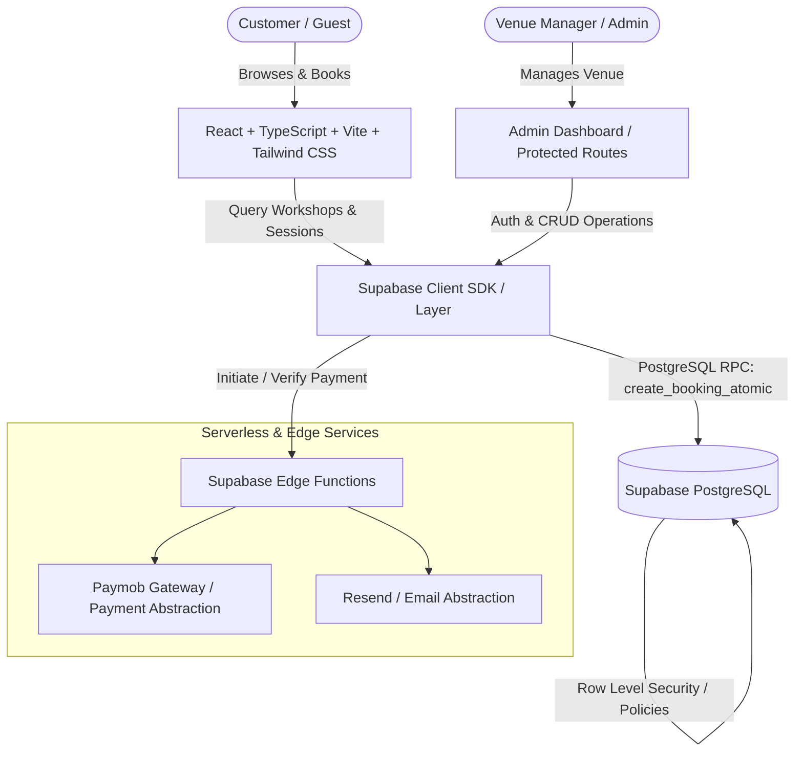

# Clayton Art House — Architecture & Implementation Blueprint

## 1. Executive Summary & Brand Identity
**Clayton Art House** is a premier creative sanctuary located in **Kafr Abdo, Alexandria, Egypt** — a leafy, historic neighborhood celebrated for heritage villas, boutique cafes, and an artistic community. 

The digital platform delivers:
- An editorial, tactile, warm Mediterranean aesthetic blending clay/terracotta (`#C26D53`), olive sage (`#606E5B`), warm linen (`#FBF9F5`), charcoal slate (`#23211E`), and muted ochre accents.
- Seamless booking UX for individual and group creative workshops (Ceramics, Oil Painting, Botanical Cyanotype, Stained Glass, Coffee & Clay, etc.) with real-time capacity calculations.
- Concurrency-safe reservation engine preventing overbooking through atomic PostgreSQL transactions (`SELECT ... FOR UPDATE` locks).
- Dedicated administrative portal for session planning, workshop curation, real-time occupancy monitoring, customer relationship tracking, private event inquiries, and gallery management.
- Robust integration layer for Egyptian payment gateways (Paymob abstraction with test/mock mode) and transactional email notifications (Resend abstraction).

---

## 2. System Architecture

### Key Architectural Layers:
1. **Presentation Layer**: React 18+ with TypeScript, Tailwind CSS, Lucide icons, dynamic meta tags for SEO, accessible forms with zero raw technical jargon for guests.
2. **Data & State Management**: Dual-mode Supabase Data Provider:
   - **Production Mode**: Direct Supabase SDK integration with PostgreSQL, RLS policies, Auth, and Storage.
   - **Integrated Local/Offline Fallback Engine**: If Supabase remote keys are not yet configured in `.env`, the system automatically initializes a persistent high-fidelity store pre-populated with realistic Kafr Abdo workshops, sessions, customers, and bookings. This guarantees zero broken screens and full interactive functionality right out of the box while migrations remain 100% standard SQL.
3. **Booking Concurrency Layer**:
   - Database-level atomic transaction: `create_booking_atomic(p_session_id, p_customer_data, p_attendees_count, ...)`
   - Takes an exclusive row lock (`SELECT capacity, booked_seats FROM sessions WHERE id = ... FOR UPDATE`).
   - Verifies `(booked_seats + attendees) <= capacity`. If exceeded, raises an exception and rolls back cleanly.
   - Creates the booking and customer record, increments `booked_seats`, and returns the confirmed booking reference.

---

## 3. Database Schema Design (PostgreSQL)

### Tables:
- `profiles`: Linked to `auth.users`, user metadata and role flags (`admin`, `staff`).
- `admins`: Authorized admin email whitelist and permissions.
- `workshops`: Title, slug, category, short description, full editorial description, price (EGP), duration (minutes), capacity per session, difficulty, what's included, materials provided, requirements, cover image, status (`draft`, `published`, `archived`), sort order.
- `workshop_images`: Additional high-res gallery images per workshop.
- `sessions`: Specific calendar schedules per workshop (`workshop_id`, `start_time`, `end_time`, `capacity`, `booked_seats`, `status`: `scheduled`, `full`, `cancelled`, `completed`, `instructor_name`, `notes`).
- `customers`: Guest directory (`id`, `full_name`, `email`, `phone`, `total_bookings`, `total_spent_egp`, `notes`).
- `bookings`: Booking records (`id`, `booking_number`, `session_id`, `workshop_id`, `customer_id`, `attendees_count`, `total_amount_egp`, `booking_status`: `pending`, `confirmed`, `cancelled`, `completed`, `no_show`, `notes`, `created_at`, `updated_at`).
- `booking_items`: Detailed attendee attendee breakdown or add-ons if needed.
- `payments`: Transactions (`id`, `booking_id`, `amount_egp`, `currency`, `provider`: `paymob`, `cash`, `mock`, `payment_status`: `unpaid`, `pending`, `paid`, `refunded`, `failed`, `transaction_ref`, `payment_method`, `metadata`).
- `private_event_inquiries`: Group and private villa events (`event_type`, `preferred_date`, `guest_count`, `budget_range`, `name`, `phone`, `email`, `notes`, `status`: `new`, `contacted`, `quoted`, `confirmed`, `archived`).
- `gallery_images`: Venue aesthetic portfolio (`id`, `title`, `category`: `pottery`, `painting`, `garden`, `studio`, `cafe`, `events`, `image_url`, `featured`, `sort_order`).
- `site_settings`: Venue details (`venue_name`, `address_line_1`, `district`: 'Kafr Abdo', `city`: 'Alexandria', `phone`, `email`, `instagram`, `facebook`, `google_maps_url`, `booking_policy`, `announcement`).

---

## 4. Security Risks & Mitigations

| Risk | Mitigation |
| :--- | :--- |
| **Overbooking / Race Conditions** | Row-level locking in PostgreSQL (`FOR UPDATE`) via database stored procedure `create_booking_atomic`. Availability is strictly calculated server-side. |
| **Unauthorized Admin Access** | Supabase Auth + strict RLS policies on tables requiring `auth.role() = 'authenticated'` and admin profile verification. Protected React Router routes with session checks. |
| **Customer Data Exposure** | Guest customers can only read the confirmation of the booking they just created via a secure booking token / ID. Public queries only expose non-sensitive workshop and session availability numbers, never customer identities. |
| **API Secret Leaks** | `service_role` keys and payment credentials (Paymob HMAC/API key) are kept strictly in server-side Edge Functions / `.env.local` files never bundled into Vite client bundles. |
| **Input Tampering (Price manipulation)** | Prices are derived solely from the database `workshops.price` column inside the atomic transaction; the client only submits `attendees_count` and `session_id`. |

---

## 5. Execution Roadmap
1. **Project Setup**: Initialize Vite + React + TypeScript + Tailwind CSS + Lucide Icons + React Router.
2. **Design System & Typography**: Configure warm artisanal palette (Terracotta, Linen, Charcoal, Olive, Sand), typography hierarchy (Playfair Display / Serif accents, Plus Jakarta Sans), and smooth transitions.
3. **Database Architecture & SQL Migrations**:
   - `supabase/migrations/20261004000000_clayton_schema.sql` (Tables, constraints, indexes, RLS).
   - `supabase/migrations/20261004000001_atomic_booking.sql` (Concurrency lock function).
   - `supabase/seed.sql` (Rich Kafr Abdo demo data).
4. **Data Service & Abstraction Layer**:
   - Supabase client integration + robust fallback persistent local store.
   - Payment provider abstraction (`PaymobProvider` + `MockPaymentProvider`).
   - Email notification service (`ResendEmailService` + development logger).
5. **Public Pages Development**:
   - Home, Workshops, Workshop Details, Booking Flow (with instant validation and confirmation screen), About Clayton, Gallery, Contact, Private Events.
6. **Admin Dashboard Development**:
   - Authentication (Login/Logout), Overview KPI metrics, Bookings Management (filter/search/status workflow), Workshop Manager (CRUD), Session Manager (schedule/capacities), Customer CRM, Private Inquiries, Gallery Curator, Venue Settings.
7. **End-to-End QA, Concurrency & Responsiveness Testing**:
   - Validate capacity limits, overbooking prevention, booking creation, filters, mobile responsiveness, and production build.
